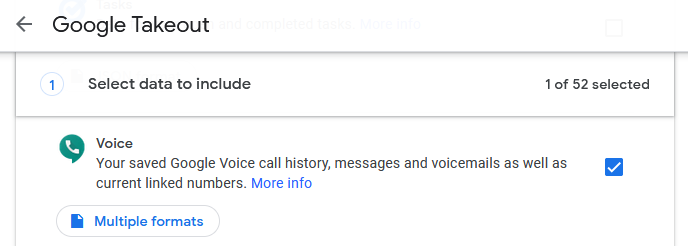

# google-voice-transformer

This application transforms your Google Voice text messages to much more readable formats.

## Features

* Combines all messages, per user, into single files so you can _finally_ search through your messages.
* Correctly displays media files instead of simply presenting the user with a link to the media file.
* Converts all video files to mp4.
* Groups all messages by the full date.
* Fixes the references to media files in your messages. Google does not include the file extension in the anchor tag. Google also references broken filenames due to having truncated long filenames in the html source.

## Screenshots

<a href="https://user-images.githubusercontent.com/4317724/158003471-2fba9d7f-cd5c-4c8c-97d3-96919a28b609.png" title="default template">
    
</a> <a href="https://user-images.githubusercontent.com/4317724/158003476-3d5376f6-8ebb-4ee5-8003-c7c33ba2c041.png" title="WhatsApp template">
    
</a>

## Requirements

Your [Google Takeout][1] data. Make sure that it includes your Google Voice data. Extract the archive and save the `Takeout` directory to disk.



## Usage

```posh
Usage: google-voice-transformer [options]

Convert the Google Takeout format to a more readable format.

Options:
  -V, --version      output the version number
  --path <string>    (optional) The path to your Takeout folder. The program will look for this folder in the same
                     directory
  --template <type>  (optional) The output file template (choices: "default", "whatsapp")
  -h, --help         display help for command
```

This application is ran from the command line. The options are optional. An `output` folder will be created in the directory this application is ran.

`--path`: if you leave this empty the application will default to looking for your `Takeout` folder in the same directory from which this application was ran.

`--template`: if you leave this empty the application will use a style similar to Google Voice.

### Command line examples

_Default template with the Takeout folder in the same directory._

```posh
.\gvt-win.exe
```

_WhatsApp template with the Takeout folder in the same directory._

```posh
.\gvt-win.exe --template whatsapp
```

_WhatsApp template with the Takeout folder on another drive._

```posh
.\gvt-win.exe --template whatsapp --path D:\Takeout
```

## Issues

* If you have messages that are more than a decade old it is normal to see a warning on the command line about missing media files. This is due to Google not including your very old media files into the Takeout archive.

[1]: https://takeout.google.com/settings/takeout "Google Takeout"
